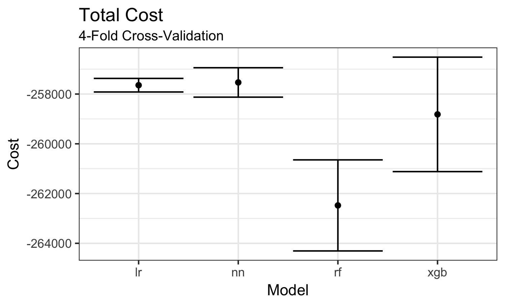
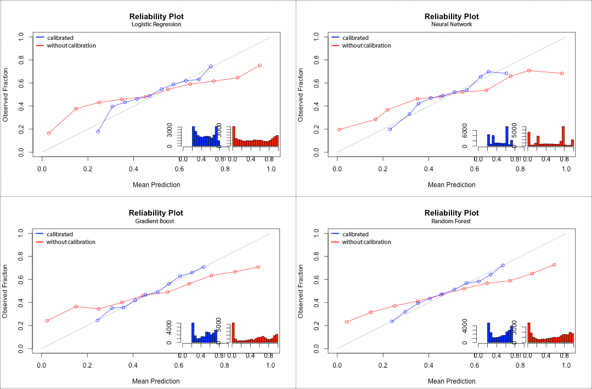
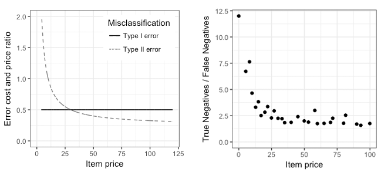

```{r, eval = TRUE, echo = FALSE, include = FALSE, cache = TRUE}

wd = paste0(Sys.getenv("USERPROFILE"), "/bads-ws1718-group21")
knitr::opts_knit$set(root.dir = wd)

```

```{r global_options, include=FALSE}
knitr::opts_chunk$set(fig.pos = 'H')

```
\pagenumbering{gobble}

<!-- \newcommand{\quantnet}{\hspace*{\fill} \raisebox{-1pt}{\includegraphics[scale=0.05]{C:/Users/Julian/cms/bachelor-thesis_Winkel/written/thesis/qletlogo.pdf}}\,} -->


\makeatletter
\renewcommand\paragraph{\@startsection{paragraph}{4}{\z@}%
            {-2.5ex\@plus -1ex \@minus -.25ex}%
            {1.25ex \@plus .25ex}%
            {\normalfont\normalsize\bfseries}}
\makeatother
\setcounter{secnumdepth}{4}
\setcounter{tocdepth}{4}    

\bigskip

\begin{center}

\textbf{Predicting E-Commerce Returns with a Heter ...  TBD}


\medskip
Humboldt-Universität zu Berlin \linebreak     
School of Business and Economics  \linebreak
\medskip


\includegraphics[width=0.2\textwidth]{HU_Logo_small.png}


by  \linebreak  

\textbf{Claudia Günther, Phi Nguyen, Julian Winkel}  \linebreak  
xxx, 526624, 562959 \linebreak
\textbf{Group 21} \linebreak

\medskip

\medskip


Berlin, Date \linebreak

\end{center}


\begin{abstract}

\smallskip
High product return rates are common in online apparel shops offering generous return policies. From the retailer's perspective, a tradeoff exists between higher sales and higher return costs due to these return policies. We address this tradeoff by developing a heterogeneous ensemble model for predicting product returns. Our model predictions can be combined with a preventive intervention system to lower return rates. We go beyond maximizing model accuracy and instead incorporate asymmetric misclassification costs to minimize expected return costs. We demonstrate how multiple resampling loops can be implemented to ensure the stability of hyperparameters and refrain from overfitting. We also present a comprehensive feature engineering approach, which helps us explore the factors driving product returns. Our ensemble model is a stable and flexible return prediction tool, which enables online retailers to achieve considerate cost reduction.

\bigskip


\end{abstract}

\newpage

\listoftables

\newpage

\listoffigures

\newpage


\begin{Large}
\textbf{Abbreviations} \linebreak
\end{Large}

\begin{tabular}{ll}
\textbf{ANN} & Artificial Neural Network     \\
\textbf{EM} & Ensemble Model(s)    \\
\textbf{LM} & Linear Model(s)    \\
\textbf{WOE} & Weight of Evidence \\

\end{tabular}


\newpage

\pagenumbering{arabic}

\tableofcontents

\newpage

\section{Introduction}


A major obstacle for companies participating in the rapidly rising E-Commerce sector are excessive product returns. Up to 35 % of the total sales in high fashion apparel are affected by this phenomenon [@toktay_2004].
Historically, rising product returns have been often regarded as a necessary evil that is a byproduct of equivalently rising sales [@petersen2009product]. Nowadays, having customer- and product-specific data en masse in combination with easily available computational power and sophisticated machine learning algorithms, there is no more need for companies to remain blind towards unnecessarily high rates of product returns and the associated risk.

The possibility of free returns may be regarded as a result of fierce online competition, to enhance customer satisfaction and loyalty or to decrease risk on the buyer side and consequently pushing revenues [@urbanke_2015]. Another common argument in favor of the matter is to reduce uncertainty of a potential customer concerning products, which is generally higher in comparison to the haptic product experience in a brick-and-mortar store [@lessmann_2016].

Though generous return policies can increase online product sales, high product return rates are reported to have substantial impact on a company's profitability. Therefore, it would be desirable to balance the tradeoff between the mentioned advantages on the customer side and the losses on the corporate side. In order to do so, the drivers of product returns must be laid out in advance. Such causes are including, but not limited to, uncertainty over a product appearance, incorrect fit, item defects, fraudulent behavior, as well as damage inflicted by the customer [@potdar_2009].

Several measures intended to counter such behavior have been proposed by @urbanke_2015. Suggested counter-measures include increased delivery time, moral suasion or transaction denial. Proposing limited payment options is in line with @pur_2013, who find that advanced payment (Vorkasse), instant transfer (Sofortüberweisung) and direct debit (Lastschrift) present a higher restriction to product returns and therefore decrease the likelihood of such. @lessmann_2016 propose the development of a machine learning system that tracks customer's shopping carts. In case of a high likelihood of product returns, a warning may be displayed. Such an approach has been successful in decreasing the addressed issue. We expand on this warning system approach in the context of asymmetric misclassification costs.

In this paper, we develop an ensemble model in order to understand the features that drive product returns, predict them accurately, and increase company profit by reducing return cost. After a brief literature review, we elaborate on the design for heterogeneous ensemble models and describe our baseline classifier selection. We then describe the data set of interest and our extensive feature engineering work. The main section presents our experimental setup, including performance measurement and model building. Following this, we present our empirical findings and conclude.

<!-- Some of these options are already in practice for multiple large online retailers (http://www.retailwire.com/discussion/should-chronic-returners-be-banned/, https://www.nbcchicago.com/news/local/Amazon-Bans-Woman-For-Life-Over-Too-Many-Returns-388199532.html) -->


<!-- ---- -->
<!-- Such a forecast may supply companies with information on the reverse product flow and increase their inventory control [@brito_2009]. -->
<!-- ---- -->

\section{Previous Literature}

@pur_2013 report a lack of consciousness towards the risk and profit options caused by product returns present among many companies. Specifically, almost 40% of all online retailers are not aware of the associated cost. According to @pur_2013, the main reason for product returns is poor item fit. A third of the surveyed companies expect their profit to rise by 5% in case of a 10% return decreasing, implying great return management potential.

@lessmann_2016 and @lessmann_2013 enrich the literature with applied ensemble models in churn and customer return prediction tasks. They show that the overall performance is generally superior to each of the constituent's contribution. The accuracy increases with higher diversity among the underlying models. Additional insight in the construction of data-driven prediction systems are provided, as linear data growth may cause exponentially increased computation time.

@urbanke_2015 present a new framework to large-scale feature extraction. They mitigate common problems caused by sparse data matrices using dimensionality reduction in terms of Mahalanobis Feature Extraction. They report an outperformance compared to standard machine learning techniques.

@toktay_2004 conclude that, despite the economic impact, literature on predicting product returns is generally sparse. Existing models are criticized to disregard relevant influential variables as product price, rebates, environmental consciousness and return price. They emphasize the possibilities of accurate product return predictions on supply chain management and inventory control.  

Implications for reverse inventory flow are laid out by @potdar_2009, who classifies product returns in the Consumer Electronics Industry according to the reason for which they have been returned. Especially Data Envelopment Analysis and Linear Regression are used for reason-specific analysis.

In line with @toktay_2004, @urbanke_2015 report a lack of academic literature on the regarded issue. They recommend future research to rely on the usage of machine learning to predict product returns in advance of the actual transaction.

@Badea_2014 uses ANN to predict consumer behavior in Romania. Using a publicly available dataset on household as well as individual level, it is investigated whether the individuals would save money using bank deposits under certain conditions. The resulting predictions of the ANN are found to substantially increase accuracy compared to the ones of classical discriminant analysis.

\section{Methodology}

\subsection{Heterogeneous Ensemble Models}

The idea behind ensemble models (EM) is to combine multiple learning algorithms that, taken together, improve prediction accuracy over the performance of the individual models. The success of EM in predictive analytics is due to their ability of reducing both bias and variance by combining multiple model forecasts [@dietterich2002ensemble]. EM can be divided into homogeneous and heterogeneous approaches. Homogeneous EM use a single base-learning algorithm (e.g. decision tree) on distinct training sets. In contrast, heterogeneous EM train and combine learning algorithms of different types. In the context of classification problems, heterogeneous EM are also referred to as multi-classifier systems (MCS) and have gained increasing popularity [@ranawana2006multi]. Two key design features for the success of MCS is the diversity among the selected classifiers as well as the good individual performances (strength) of the baseline classifiers [@shahid2015ensemble]. However, is has been shown that neither diversity nor individual performance of baseline models can directly predict the ensemble success [@ranawana2006multi].

MCS have been shown to be useful in predicting customer e-commerce behavior, outperforming single classifiers in prediction accuracy (@tsoumakas2008taxonomy, @kim2003combination). Specifically, @lessmann_2016 demonstrate the suitability of an ensemble selection approach (ES) for predicting product returns in online retailing. This three-step ensemble technique builds upon the creation of a library of heterogeneous candidate base models. Each classifier method can be used to build up multiple models with different meta-parameter settings. The ensemble model is created by combining base model from the library through an extensive search strategy. Though this approach has been demonstrated to be very effective for accurate predictions, it nevertheless requires extensive computational time. We therefore adopt a standard two-step ensemble approach. First, we develop and train four base classifiers models. Second, we combine these individual models with a simple non-linear combination method, namely unweighted majority voting. We opt for this majority voting technique since because it is computationally inexpensive and is likely to improve model accuracy in cases when individual baseline models are well trained [@kuncheva2004combining]. In case of a voting tie, the base model with the highest single accuracy will act as a tiebreaker.  

\subsection{Base Classifier Models}

The ensemble model consists of four separately trained constituents as summarized below. We select them due to their outstanding performance as classification models. Since the relationship between product returns and the independent variables is suspected to be of non-linear nature, the majority of the base models captures effects of such nature. Nevertheless, as information heterogeneity substantially influences the performance of an ensemble model, we use a simple logistic regression to capture linear relationships among the variables.

We then employ an artificial neural network (ANN), which is a statistical model inspired by the functionality of the human brain. It consists of an input layer, possibly multiple hidden layers and an output layer, in which an activation function sends a signal dependent upon the processed input. @pacelli_2011 figure ANN successful in unveiling complex relationships, especially in combination with linear models, but emphasize the need to train them extensively for the risk of remaining in local minima during minimization of the error function.

Following @singapore_2013, the inclusion of a random forest model enriches the information drawn from ANN and logistic regression as it does not rely on estimated predictors and is not prone to overfitting. Random forests are additionally useful for their ability to natively handle feature selection.

Finally, we consider a gradient boosting model, which starts with a simple classifier then iteratively adds additional models that corrects the error of the prior model. We specifically employ the DART (Dropouts meet Multiple Additive Regression Trees) algorithm as proposed by @Rashmi over the more traditional as described by @Friedman00, as it solves the problem of over-specialization, where trees added at later iterations impact the prediction of only a few instances. It does so by randomly muting trees, which often results in a more balanced contribution from all of the trees and occasionally outperforms even random forests [@Rashmi].

We include a summary of the base classifiers and the hyperparameter space in Table 1.

|      Classifier     |    Relationship   | Hyperparameter | Possible Values |
|---------------------|:-----------------:|----------------|-----------------|
| Logistic Regression |     linear        |    NA          |  NA             |
| Neural Network      |     non-linear    |    size        | {4,5,6,7,8}     |
|                     |                   |    decay       | {1e-7,1e-6,1e-5,1e-4,1e-3,1e0-2,0.05,0.1,0.5} |
| Random Forest       |     non-linear    |    ntree       | {300,350,400,450,500} |
|                     |                   |    mtry       | {3,4,5,6} |
|                     |                   |    nodesize       | {5,10,15,20,25,30} |
| Gradient Boost      |     non-linear    |    booster     | dart |
|                     |                   |    gamma       | {0,0.1,0.2} |
|                     |                   |    eta       | {0.001,0.01,0.1,0.3} |
|                     |                   |    nrounds       | {50,100,200} |
|                     |                   |    lambda       | {0,0.1,0.2,0.3,0.4,0.5,0.6,0.7}  |
|                     |                   |    max_depth       | {3,4,5,6}  |

Table: Base classifier description


\section{Data}
The two data sets available to us contain a total of 150,000 order records from an online apparel retailer from a yearlong selling period. For 50,000 of these records, it is unknown whether an ordered item has been sent back by the customer or not. This second data set is the target of our binary predictions on customer returning behavior (return/not return). Both data sets include a total of 13 continuous/discrete and categorical variables. These covariates give information on customer demographics (e.g. user state, date of birth, title), order details (e.g. order date, delivery date), and item characteristics (e.g. item size, price, color). The majority of customers are middle-aged female shoppers, with a mean order volume of 70 Euro over the entire record period and a mean product return rate of 48%.

To prepare the data sets for our analysis, we apply a set of standard pre-processing actions. We begin by carefully inspecting all variables to remove all implausible values (e.g. extreme outliers). Approximately 20% of all records have missing values in the variables *delivery date* and/or *date of birth*. For improved comprehensibility, we transform these covariates to *delivery time* and *age* respectively. Before imputing missing values, we flag them using dummy variables to extract their predictive power [@de2016advanced, 18]. Since *age* seems to be missing completely at random according to our data inspection, imputing it using mean substitution gives us an unbiased estimates [@schafer2002missing]. Missing values in delivery time, caused by missing delivery dates, are clearly not missing not at random as they have a zero mean return rate and therefore are a perfect predictor. Possible reasons for these missing values are manifold. Without knowing the process generating these missing values, we cannot find unbiased substitutes from them [@schafer2002missing, 171]. We adopt three single substitution methods: case dropping, mean imputation, and median imputation. We choose median imputation due to model performance and to avoid underestimation of variance. We standardize the continuous variables only after the feature creation step to maintain their interpretability. Likewise, we do not directly drop (almost) zero variance predictors (e.g. date of birth) since we use them for feature extraction.

\section{Feature Engineering}

\subsection{Feature Construction}
Comprehensive feature engineering, i.e. creating and selecting useful and informative features, is the key to successful e-commerce prediction models [@liu2016repeat]. Based on the data structure available, we separate our indicators into three e-commerce-related categories, namely product-, customer-, and basket-related features. Features in the product category are all item-specific indicators (e.g. item price). Likewise, customer-related features contain variables with relational or demographic information on each customer (e.g. customer age). We define the basket-related features as those that are common within one order basket (e.g. number of items within a basket). We consider all items that were ordered by the same user on the same day as belonging to the same basket.

Table: Constructed features ordered by category (excerpt)

|Feature category |   Feature         |   Type  |Description                                  |
|:---------------:|:------------------:|:-------:|:----------------------------------------------------:|
| Product         | Item price   |  Numeric |Price at which item is purchased                                   |
|                 | Item category|  Factor  |Category (eg. clothing, shoes) of item                             |
|                 | Item WOE     |  Numeric |WOE based on item id                                               |
| Customer        | Customer Age |  Numeric |Age in years at purchase                                           |
|                 | Account Age  |  Numeric |Days since registration at purchase                                |
|                 | User's income|  Numeric |Proxy for costumers's income                                       |
| Order/Basket    | Large basket |  Factor  |No. of items in same basket exceeds one                             |
|                 | Discount pc. |  Numeric |Discount on item price in %                                        |
|                 | Same category|  Numeric |No. of items belonging to the same item category within same basket|

In order to extract as much information as possible from the 13 original variables, we apply a variety of different extraction and projections methods, including unsupervised and supervised methods. Our extraction methods can be broadly summarized in four groups: discretization, projection, transformation/combination of variables, and external information-driven data augmentation. Based on these methods we construct an enriched data set with a total of 45 features. A small excerpt of these features can be seen in Table 2.

We apply discretization to several continuous variables, as this can be useful for capturing non-linear effects, constructing a more comprehensible representation of variables or improving predictive accuracy, especially in the context of tree-based decision algorithms [@liu2002discretization]. For example, we construct price item bins using equal frequency discretization, as we suspect non-linearity regarding the target variable. This approach is superior to equal width discretization for our purpose since it is outlier-resistant and gives us a higher interval resolution for item prices with a high density [@cichosz2014data, 531].

A special challenge of this data set, which applies to many predictive modeling settings on customer behavior, is the presence of high-cardinality attributes (e.g. user id). We address this by replacing each category with its Weight of evidence (WOE), a numerical projection method for categorical variables. The WOE is a measure of predictive power of a category with respect to the target variable, which has gained popularity in credit scoring [@de2016advanced, 19-20]. For a given customer, it shows a customer's tendency in returning behavior, a valuable predictor variable. Since WOE has been shown to work well across the different types of our baseline models, requires low computational effort, and reduces dimensionality [@de2016advanced, 32-33], we apply this projection method to all categorical variables. For categories where WOE is not computable due to class sparseness, we add artificial data points as suggested by @kohavi1997wrappers.

Another useful approach we take is the transformation and combination of variables based on domain knowledge about consumer's shopping and returns behavior [@arnold2003hedonic]. For example, we expect that discounted items will have a lower return rate due to lower item quality expectation as proposed by @petersen2009product. Thus, we construct several discount variables (e.g. absolute discount, percentage discount) by taking the maximum item price for each item as proxy for the regular item price and considering all deviations as a discount. Furthermore, a common defect of online shopping is that customers might be unsure about which size or color they should order based on the item description and thus place multiple orders of the same item [@foscht2013retaining]. We therefore construct informative variables on the order basket of consumers, e.g. the basket size in terms of items or the number of similar items with distinct sizes within one basket.

Furthermore, we augment and enrich the data sets by including external sources to construct new features. For example, we use statistics on the mean income for different age groups and different regions within Germany. By combining these indicators with each customer's demographic data (age and user state), we are able construct a proxy for each customer's income. Moreover, we tackle the lack of information on item categories (e.g. pants, shoes, clothing, accessories). Based on size tables for different apparel categories we gathered, we are able to categorize over 90% of items by finding sizes unique to each category. As expected, the mean return rate of shoes (52%) is almost twice as high as mean returns in accessories (28%).

\subsection{Feature Selection}

Finding an optimal feature subset is important for various reasons: First, learning algorithms like neural networks or tree-based models have been shown to degrade in performance when confronted with datasets containing redundant or irrelevant variables [@zdravevski2014feature]. Second, feature selection reduces data dimensionality, reducing the needed computational power for the model building process and improving model comprehensibility. We adopt a hybrid feature selection strategy by combining both filters and wrappers.

As a first preprocessing step as proposed by @zdravevski2014feature, we remove very poor variables based on model-agnostic information criteria. For numerical variables we compute the F-Score as proposed by @chen2006combining, whereas the average information value (obtained from WOE) is computed for categorical covariates.

The second step in our feature selection is a wrapper approach as described in @kohavi1997wrappers. This greedy selection strategy is advantageous since it has been shown to be robust against overfitting and is designed to optimize model performance [@guyon2003introduction, 1167]. We use a sequential floating backward selection (SFBS) algorithm as proposed by @pudil1994floating. SFBS is able to capture interaction effects between variables better than non-floating approaches and has been shown to provide good results in comparable medium-scale problems [@kudo2000comparison].

Since the single baseline models from our ensemble model might perform best on distinct feature subsets, the optimal approach would be to conduct an individual wrapper for each model. Due to computational constraints, we are nevertheless limited to conducting a single wrapper for all models. As feature subsetting is especially important for tree-based models and neural networks, we design a wrapper based on a simple random forest. The experimental setup is similar to our inner resampling approach during baseline model training (section 6.2.1) The SFBS leaves us with a final subset of 17 features.

\section{Experimental Design}

\subsection{Performance Measurement}

To evaluate final predictive power, we consider two performance measures - classification accuracy and logarithmic loss. Classification accuracy is the number of correctly classified observations divided by the total number of observations. We use this initial measure due to its ease of interpretability. However, this measure does not differentiate between types of error (which is important due to asymmetric costs) nor does it penalize overconfidence in classification. Therefore, we additionally look at the logarithmic loss, a form of cross-entropy. Logarithmic loss is applied when the desired outcome is the probability that an example is positive. The formula for logarithmic loss is shown below, where N is the total number of observations, $y_i$ is the true outcome, and $p_i$ is our predicted probability outcome. This measure is designed to penalize overly confident but misclassified observations and is often preferred for binary classification problems like ours [@Caruana04datamining].

$$logloss = -\frac{1}{N}\sum_{i=1}^N [y_ilog(p_i)+(1-y_i)log(1-p_i)]$$

Finally, we consider predictive power within the framework of our specific prediction task, which is to minimize the cost associated with incorrect classifications. Specifically, our problem deals with example-dependent misclassification costs because the penalty for false classification is associated with the item's corresponding cost. Namely, in the event of false positive classification (we incorrectly predict the customer will return), there will be an opportunity cost of a lost potential purchase of $-0.5*item price$. In the event of a false negative classification (we incorrectly predict the customer will not return), we incur an actual financial penalty of $-0.5*5*(3+0.1*item price)$. For our purposes, we consider both actual and opportunity costs as impacting our cost calculations.

To solve this problem, we use a threshold approach. The threshold approach selects the probability cutoff point that minimizes the total misclassification cost from the training data set and uses it to predict the class label of the test instances. Test instances that have a predicted probability below or equal to this threshold are classified as a negative instance, whereas test instances with a probability higher than the threshold are classified as a positive (i.e. return) instance. Despite its simplicity, thresholding often outperforms other cost-sensitive learning methods [@ShengL06].

Our specific approach mirrors a similar approach as suggested by @Fawcett2006, in which he generates a ROC curve that is sensitive to instance-varying costs. In our approach, we loop through a sequence of possible threshold values between 0 and 1, plot the corresponding accuracy and cost, then select the threshold that minimizes the overall cost. Since costs are shown as negative, we seek to maximize the value. We plot these graphs showing the accuracy and costs side by side given different threshold points for each of the four classifiers in Figure 1. Notice how the threshold that optimizes costs is different from the one that maximizes accuracy.


\subsection{Model Building}

\subsubsection{Nested Resampling}

In order to obtain reliable out-of-sample performance estimates for each classifier and the overall ensemble model, we undertake a nested resampling approach. This approach employs two cross-validation loops. We use the inner loop to tune the hyperparameters, while we use the outer loop to estimate how the model will generalize to a new, unknown data set by averaging the test results [@hastie01statisticallearning, 241].

In the outer loop, we use 4-fold cross-validation. In this approach, we partition the initial test set containing 100,000 observations into four equally-sized randomly stratified groups. For each iteration of the loop, we set aside the i-th partition for testing, while we use the remaining 4 partitions to train the individual classifiers (logistic regression, neural network, gradient boosting, random forest).

In the inner resampling loop, we train each classifier using a fixed holdout instance to find the optimal hyperparameters on each of the individual classifiers. Using a fixed holdout set enables us to standardize numeric variables and create our WOE features (by calculating off the training set and applying those values to the holdout set) within the inner loop. This preprocessing step is necessary for all variable transformations that are dependent on the data to prevent overfitting the model.

The inner resampling loop assesses the quality of the model given the chosen hyperparameters. With the consideration that a grid search across the entire hyperparameter search space would be too computationally intensive, we choose to instead do a random search across the search space. The random search method will randomly choose parameters from our specified values, with a maximum of 20 iterations. Additionally, we train each classifier to optimize for AUC (area under the ROC curve), since such classifiers tend to produce better accuracy relative to those that only optimize for accuracy [@Huang05usingauc]. The chosen hyperparameters are then passed on to the outer loop where a new model is trained with the corresponding hyperparameters. In order to improve speed and scalability, we wrap each hyperparameter tuning process in a parallelization loop. Finally, we predict the results on the outer loop holdout set and aggregate results.

We validate the nested resampling process by viewing the predictive power (in terms of accuracy and total cost, respectively) across resampling iterations and for all classifiers is shown in Figures 2 and 3. The dot in the center represents the average value, whereas the spread is indicated by one standard error above and below the mean. On average, the neural network consistently performs best both on prediction accuracy and total cost metrics. In comparison, gradient boosting tends to perform the worst in terms of prediction accuracy but random forests perform the worst in terms of total cost minimization. Logistic regression, as expected, shows the smallest variation between iterations. However, although neural networks and logistic regression tends to vary little between iterations, gradient boosting and random forest approaches have far larger variations between iterations in terms of total cost minimization. The best performance of any one run came from a gradient boost iteration.




\subsubsection{Model Calibration}

Alongside our 4-fold cross-validation, we calibrate the probability estimates generated from each classifier in our outer loop. We use calibration for two reasons: Firstly, it ensures that the probability estimates better reflect their true posterior probabilities [@Caruana2006]. For example, in a well-calibrated model, if the probability estimate for a given instance is 70%, that means we can assume that event has a 70% chance of occurring. Secondly, calibration transforms predictions from all models to place on them equivalent scale. Combining calibrated models in ensembling not only provides improvement in probability measures like logarithmic loss. Failure to use calibrated models may actually hurt ensemble performance [@Niculescu-Mizil2005].

We use a method known as Platt scaling to obtain calibrated predictions. In Platt scaling, we pass the output probabilities through a sigmoid (which in our case is a logistic regression) [@Platt99probabilisticoutputs]. We apply the specific method below as described in [@obtainingcalibrated] in order to prevent overfitting and unwanted bias:

1. Split the data set into a training and a test set
2. Split the training data set further into a calibration set
3. Train the model on the training set
4. Predict the model on the calibration set and the test set
5. Use the predictions from calibration set to train a logistic regression model
6. Pass the predictions from the test set through the trained model in step 5 to obtain the final predictions

We visualize the effect of calibration on each of our classifiers using reliability diagrams from the first fold of cross-validation which can be seen in Figure 4. Reliability diagrams split the prediction space into 10 bins, then plot the mean prediction value for each bin against the true fraction of positive cases. The diagonal line indicates a perfectly calibrated model [@Niculescu-Mizil2005]. Additionally, in each diagram, we plot the histogram of predicted values before and after calibration.



From the reliability plots, we can see a few major effects of calibration. Firstly the results after calibration (the line in blue) shift away from a sigmoidal shape (the line in red) to to line up closer to the diagonal line indicating a perfectly calibrated model. Secondly, calibration pushes the probabilities closer to the center and away from 0 and 1, to better align with the true fraction of positive cases and prevent overconfidence in classifications. One benefit that we can recognize from the reliability plots is that overall, each histogram post-calibration appear similar to one another because calibration reduces the differences between predicted probabilities for each model, which will provide usefulness in ensembling [@Niculescu-Mizil2005].

Overall, we see benefits in calibration when comparing the accuracy, log-loss, and cost metrics. In Tables 3, 4, and 5, we compare the average across all validation runs for the aforementioned metrics. We see that calibration yields significant improvements in log-loss error for all models without negatively impacting accuracy and cost measurements.

```{r, echo = FALSE, eval = TRUE, warning = FALSE, message = FALSE, results = 'asis'}

library("knitr", quietly = TRUE)
library("xtable", quietly = TRUE)

knitr::opts_chunk$set(message = FALSE)

# For both tables
classifier = c("Logistic Regression", "Neural Network", "Random Forest", "Gradient Boost")

# Accuracy Comparison Vectors
acc.uncalibrated = c(0.657, 0.662, 0.656, 0.653)
acc.calibrated = c(0.657, 0.661, 0.656, 0.654)

# Log Loss Error Comparison Vectors
loss.uncalibrated = c(0.709, 0.774, 0.774, 0.817)
loss.calibrated = c(0.618, 0.621, 0.625, 0.628)

acc.df = data.frame("Classifier"   = classifier,
                    "Uncalibrated" = acc.uncalibrated,
                    "Calibrated"   = acc.calibrated)

loss.df = data.frame("Classifier"   = classifier,
                     "Uncalibrated" = loss.uncalibrated,
                     "Calibrated"   = loss.calibrated)


t1 = knitr::kable(acc.df, format  = "latex", booktabs = TRUE)
t2 = knitr::kable(loss.df, format = "latex", booktabs = TRUE)

cat(c("\\begin{table}[!htb]
    \\begin{minipage}{.5\\linewidth}
      \\caption{Accuracy comparison}
      \\bigskip
      \\centering",
        t1,
    "\\end{minipage}%
    \\begin{minipage}{.5\\linewidth}
        \\caption{Log-Loss error comparison}
        \\bigskip
        \\centering",
        t2,
    "\\end{minipage}
\\end{table}"
))  

```
<!-- Just keeping these old tables as a backup -->
<!-- |      Classifier     | Uncalibrated | Calibrated | -->
<!-- |:-------------------:|:------------:|:----------:| -->
<!-- | Logistic Regression |     0.657    |    0.657   | -->
<!-- | Neural Network      |     0.662    |    0.661   | -->
<!-- | Random Forest       |     0.656    |    0.656   | -->
<!-- | Gradient Boost      |     0.653    |    0.654   | -->

<!-- Table: Accuracy comparison -->

<!-- |      Classifier     | Uncalibrated | Calibrated | -->
<!-- |:-------------------:|:------------:|:----------:| -->
<!-- | Logistic Regression |     0.709    |    0.618   | -->
<!-- | Neural Network      |     0.774    |    0.621   | -->
<!-- | Random Forest       |     0.774    |    0.625   | -->
<!-- | Gradient Boost      |     0.817    |    0.628   | -->

<!-- Table: Log-loss error comparison -->

|      Classifier     | Uncalibrated | Calibrated |
|:-------------------:|:------------:|:----------:|
| Logistic Regression |   -257376.4  |  -257644.0 |
| Neural Network      |   -257108.2  |  -262476.1 |
| Random Forest       |   -262464.2  |  -257532.9 |
| Gradient Boost      |   -258767.0  |  -258816.6 |

Table: Total cost comparison

\subsubsection{Ensembling}

As our last model building step, we ensemble models from each of the k runs and compare the final combined result to the average of the individual candidate classifiers. Our ensemble approach uses majority voting. Given that we are ensembling four models, we use the best model in terms of cost minimization as a tie breaker, which is our case, the neural network. For each of the 4 iterations of the cross-validation process, we use our ensembling method to assign final predictions for each instance.

\subsubsection{Post-Processing}

The final class memberships of our model predictions are the results of our cost-minimizing threshold strategy. Despite the suitability of threshold tuning in general, the outcome might not be optimal due to the presence of cost asymmetry. This holds especially true for the items with a low item price, where disparity between the distinct classification errors is the largest. This can be seen in Figure 5 (left) where the error costs relative to the item price are displayed for both types of misclassification. We refer to those predictions as Type 1 Error, if the predicted value ends up being a False Positive (FP), meaning that we erroneously predicted an item return to be returned by the customer. In contrast, the Type 2 Errors relate to the False Negatives, which implies we predicted a non-return when the item has in fact been returned. For low item prices, the spread between both error cost ratios is very high because of the fixed return costs being relatively high to item price. We therefore suspect it may be cost-saving to manipulate our model predictions to reduce the costs of FN.



Specifically, we test whether it is more costly to use our predicted model classes or to always predict customers to return the low price item and thus save on shipment costs ("pure return strategy"). For a given item price, our pure return strategy saves costs if the savings in shipment costs outweigh the losses of items that would not have been returned by customers(TN). Thus, it must hold that $0< \frac{C2}{C1} - \frac{TN}{FN}$ where C1 and C2 refer to the misclassifications errors of type 1 and 2 at a given item price. Since some item price levels have sparse class membership, we create equal frequency price bins and approximate C1 and C2 with mean error costs.

We test our strategy based on the baseline prediction of our logistic regression model on a stratified test set. In our sample, the pure return strategy only saves costs for a item price of zero. This is because the high spread between costs is outweighed by the high ratio between TN and FN. This can be seen in Figure 5 (right), where this ratio os displayed for all price bins. As very few cheap items are returned by customers, the number of FN is small in low price bins, leading to a high ratio.

\section{Empirical Results}

Overall, both the baseline models and our ensemble models perform well in terms of performance measures and plausibility. The results of the individual models align well with customer return mechanisms suggested by previous literature. As suggested by @petersen2009product, the discount on an item price is negatively associated with item returns, whereas the opposite holds true for the item price itself. Features like customer age and total customer expenditure are correlated negatively with returns, which can be explained by a lower order uncertainty driven by increased shopping experience and income effects. In contrast, most basket-related features are positively correlated with item returns. Large baskets as well as the presence of the same item multiple times within the same basket help predict higher item returns. In terms of variable importance, we find that WOE based on user id, WOE on item id and the flagged missing values in delivery date are the most important features.

The high variable importance of WOE on user id as well as total costumer expenditure point towards customer-specific returning behavior. It therefore may be recommendable to create user-specific profiles that can be continuously updated. The importance of WOE on item id shows that some items are notably more frequently returned than others. These returns might be avoided if the item descriptions are adjusted to change customer expectation. The high predictive power of flagged missing values in delivery date should be carefully inspected. For example, if they are result of a unfulfilled delivery due to an incorrectly specified destination address, their indicated cost-saving potential is misleading.

One interesting aspect we note regarding our variables is diminishing returns in feature addition. Our model quickly incorporates information that is contained in the data and adding further features yields limited performance increases.   

Regarding model performance, our baseline models all perform well in terms of prediction accuracy, with neural networks consistently performing the best. In contrast to our expectation, logistic regression outperforms random forests and gradient boosted trees on average. We explain this surprisingly good performance of logistic regression compared to random forests with existence of linear effects and our meticulous data preparation. As @coussement2017comparative have demonstrated, logistic regression can compete with more complex algorithms if exposed to well prepared data sets.

In terms of costs savings, neural networks again generate the best results. Random forest, logistic regression and gradient boosted trees perform equally well. On average, our individual models have a cost-saving potential of roughly *18%* compared to the status quo scenario (not predicting any returns). As expected, our ensemble model performs even better in terms of costs, though the difference is not too large as can be seen in Table 6.   

Table: Cost improvement from ensembling

|Iteration|Average Classifier|Ensembled|% Improvement|
|:-----:|:-----:|:-----:|:-----:|
|1|-261651.96|-256435.62|0.0199|
|2|-256735.30|-251296.48|0.0212|
|3|-258906.22|-255041.46|0.0149|
|4|-259175.97|-257744.25|0.0055|

On average, ensembling results in a cost improvement of 1.5% over the base classifiers in terms of total costs. We note that in certain cases the best individual classifier slightly outperforms the ensemble. However, we believe our ensembling approach remains valid due to the high variation in total cost for some classifiers, depending on the observations in the data set. The ensembling process helps reduce this variation by averaging the performance of each model.

From the results of our experiments, we can expect an approximate cost reduction potential of *20%* relative to status quo scenario, a promising result. We believe that this can result in significant cost savings for the retailer over the long run.

\newpage

\section{Conclusion}

In this paper, we processed a dataset of a German online retailer in an ensemble model to understand which factors cause product returns and to perform predictions with respect to an observation-dependent cost function. On this dataset that includes order-, user-, and product-specific information, we created 45 unique features, of which we were able to extract 17 relevant ones that are used in the ensemble model. We have shown that the majority of the predictive power can be obtained by a relatively small subset of well-designed features.
Hence, the presented framework allows easy modification and further applications on real-world data. Data requirements revolve around information that any online retailer should possess already.
Our heterogeneous ensemble model leverages the predictive power of the constituent models while reducing individual variance.
In this context, corporations affected by high product-return rates can raise their expected profits by implementing the proposed model and, in case a purchase is classified to likely be a return, issue a warning towards the customer. In the experiments we ran, we have shown that implementing such a measure can achieve a cost-savings of approximately 20%.


\newpage

\section{References}


<div id="refs"></div>


\newpage

\begin{Large}
\textbf{Declaration of Authorship}
\end{Large}

\bigskip
\bigskip

TEXT

\bigskip
\bigskip

15.01.2018
